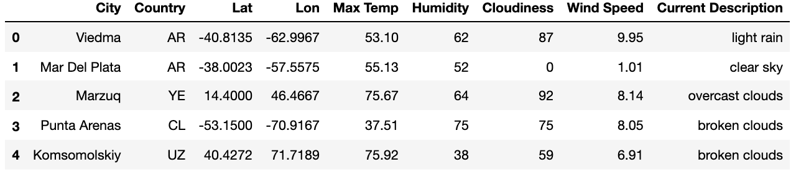
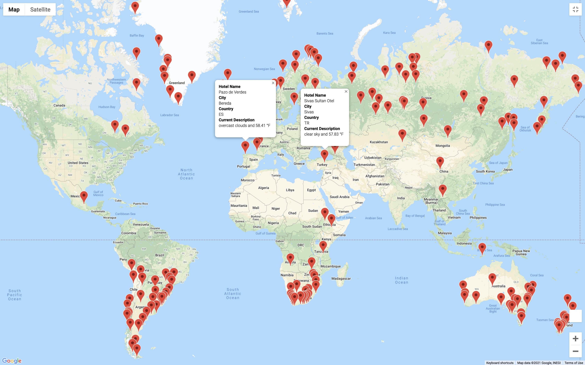
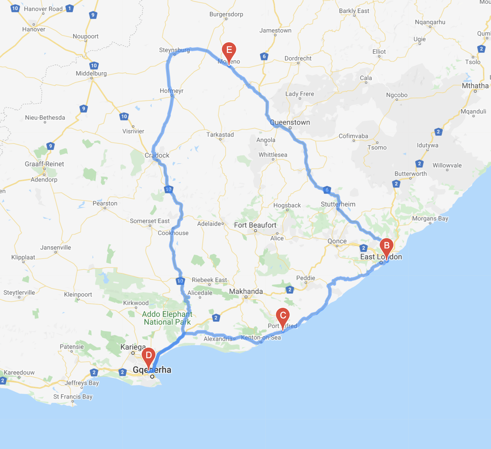

# World Weather Analysis

## Overview of the Analysis 

In this analysis, I help PlanMyTrip, an online platform that specializes in the hotel and lodging industry to help travelers visiting their internet site find their ideal travel spot. I conduct this analysis in three parts using Jupyter Notebook. I first start by building a DataFrame from random cities where I retrieve those cities' latitude, longitude, maximum temperature, humidity, cloudiness, wind speed, and current description of the weather. I pull all the data from ***https://openweathermap.org/***. I continue the second part of the analysis by filtering the data according to the temperature preference of customers to retrieve potential travel destinations and nearby hotels. Lastly, I finish the analysis by making a travel itinerary where I build a DataFrame and visualize the directions of the selected cities.  

### Objective of the Analysis 
The objective is to build a personalized experience for the user trying to decide on a travel destination. Although we start with a simple feature, through time we can build on the product to produce a more personalized experience for the end-user. We believe this is a process of constantly A/B testing before releasing the product to every user. With the feedback, we can decide whether to keep or pivot the feature.

## Results 

### Part One:
In this part, using the random.uniform function I generated 757 random coordinates. Then from these coordinates, I ran a code that searched for cities in these random coordinates, also searching for the cities' latitude, longitude, maximum temperature, humidity, cloudiness, wind speed, and current description of the weather. I later built a DataFrame of the 695 cities I found. The first 5 indexes are as seen in figure 1. 

**Figure 1: City Weather Data**

### Part Two: 

In this section, I add the input function for the user to choose the weather preference from which I generate a new DataFrame.

**Figure 2: Preferred City Weather Data**

I continued by searching for nearby hotels using Google API, and putting the name of the hotels into a new DataFrame with the hotels, and dropping the rows with NaN values.

 
**Figure 3: Preferred City Weather Data with Hotel Name**

I lastly completed this section of the analysis by marking all the hotels on Google Maps with their key information: Hotel Name, City, Country, and Current Description. 

 

**Figure 4: Preferred Hotels on Map**

### Part Three: 

In this last part, I made a random travel itinerary making a DataFrame from the four close cities I picked in South Africa.

**Figure 5: DataFrame of Travel Itinerary** 

With Google API I visualized the directions between each city using driving as the mode of travel. 

 
 
**Figure 6: Travel Route Between Four Cities** 

I lastly concluded this part of my analysis by marking the key information of the four cities in South Africa.

**Figure 7: Key Information of the Four Cities** 

# Summary 

In this analysis, I showed how customers can set their potential travel destination according to their weather preference. This is a three-part analysis where I found and marked possible hotels for the customer. Lastly, this analysis concludes by visualizing a directional map of a travel itinerary the customer desires to have. With these results, beta testers can provide constructive feedback for us to enhance the user product experience. 
